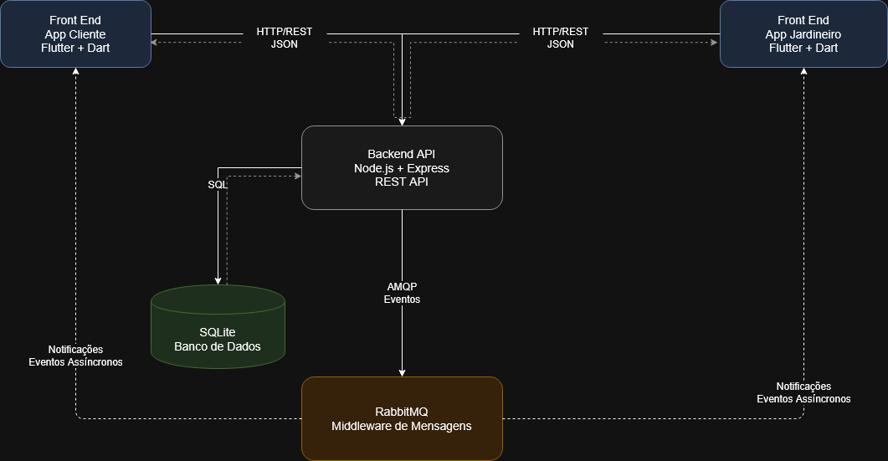

# JardimJa

## Sobre o projeto

O JardimJa é uma plataforma completa para serviços de jardinagem sob demanda, dividida em três componentes principais:
1. **Backend (`jardimja-backend`)**: API Node.js que fornece os dados, gerencia autenticação e solicitações.
2. **App do Cliente (`jardimja-cliente`)**: Aplicativo móvel para clientes buscarem serviços e solicitarem orçamentos.
3. **App do Prestador (`jardimja-prestador`)**: Aplicativo móvel para os jardineiros gerenciarem suas solicitações e alertas.

## Arquitetura do sistema



O backend segue uma organizacao em camadas inspirada no MVC, com responsabilidades separadas:

- `routes`: define as rotas HTTP e aplica middlewares de autenticacao e autorizacao.
- `controllers`: recebe as requisicoes, valida dados de entrada, decide respostas HTTP e chama os services.
- `services`: concentra regras de negocio e chamadas ao Prisma.
- `middleware`: agrupa middlewares compartilhados, como autenticacao JWT e validacao de perfil.
- `config`: centraliza configuracoes de infraestrutura, como Prisma Client e preparacao do banco local.
- `events`: publica eventos simples da aplicacao, atualmente registrados no console.
- `prisma`: guarda o schema do banco, migrations e seed inicial.

Os modelos de dados ficam em `jardimja-backend/prisma/schema.prisma`. Por isso o projeto nao possui uma pasta `models` separada: o Prisma gera o client a partir desse schema.

## Schema visual do banco de dados

O diagrama ER do banco esta em:

```text
docs/schema-banco.md
```

## Estrutura de pastas

```text
Projeto-LAMD/
|-- docs/
|-- jardimja-backend/
|-- jardimja-cliente/
|-- jardimja-prestador/
`-- README.md
```

- `docs/`: documentos do projeto, relatórios, imagens e collection do Postman.
- `jardimja-backend/`: codigo da API Node.js/Express.
  - `jardimja-backend/src/`: rotas, controllers, services, middlewares, eventos e configuracoes.
  - `jardimja-backend/prisma/`: schema do banco, migrations e seed inicial.
- `jardimja-cliente/`: Código-fonte do App Flutter para o Cliente.
- `jardimja-prestador/`: Código-fonte do App Flutter para o Prestador (Jardineiro).

## Como executar o backend

Execute os comandos abaixo a partir da raiz do repositorio:

```bash
cd jardimja-backend
npm install
```

Crie o arquivo `.env` com base no exemplo:

```bash
cp .env.example .env
```

Antes de iniciar a aplicacao, prepare o banco de dados SQLite usado pelo Prisma:

```bash
npx prisma generate
npx prisma migrate dev
npx prisma db seed
```

Depois inicie a aplicacao:

```bash
npm start
```

Por padrao, a API fica disponivel em:

```text
http://localhost:3000
```

O banco local fica em `jardimja-backend/prisma/database.sqlite`, conforme a variavel `DATABASE_URL`. Sempre que baixar o projeto em uma maquina nova ou apagar o arquivo do banco, rode os comandos do Prisma antes de executar `npm start`.

## Variaveis de ambiente

O arquivo de exemplo fica em `jardimja-backend/.env.example`.

```env
DATABASE_URL="file:./database.sqlite"
JWT_SECRET="troque_este_segredo"
PORT=3000
```

- `DATABASE_URL`: caminho do banco SQLite usado pelo Prisma.
- `JWT_SECRET`: chave usada para assinar os tokens JWT.
- `PORT`: porta HTTP usada pela API.

## Endpoints principais

| Metodo | Rota | Descricao | Acesso |
| --- | --- | --- | --- |
| GET | `/` | Verifica se a API esta em execucao | Publico |
| POST | `/auth/registro` | Cria um usuario cliente ou jardineiro | Publico |
| POST | `/auth/login` | Autentica e retorna token JWT | Publico |
| GET | `/tipos` | Lista os tipos de servico | Publico |
| POST | `/solicitacoes` | Cria uma solicitacao | Cliente |
| GET | `/solicitacoes` | Lista solicitacoes | Cliente / Jardineiro |
| GET | `/solicitacoes/:id` | Detalha uma solicitacao | Cliente / Jardineiro |
| PATCH | `/solicitacoes/:id/status` | Atualiza o status da solicitacao | Jardineiro |

## Como rodar o JSON do Postman

O arquivo da collection fica em:

```text
docs/testesPostman/JardimJa Backend API.postman_collection.json
```

Para executar:

1. Prepare o banco com `npx prisma generate`, `npx prisma migrate dev` e `npx prisma db seed` dentro de `jardimja-backend`.
2. Inicie a API com `npm start` dentro de `jardimja-backend`.
3. Abra o Postman.
4. Clique em `Import`.
5. Selecione o arquivo `docs/testesPostman/JardimJa Backend API.postman_collection.json`.
6. Confirme se a variavel `baseUrl` da collection esta como `http://localhost:3000`.
7. Execute as requisicoes na ordem da collection ou use `Run collection`.

A collection ja possui scripts para salvar automaticamente variaveis como `tokenCliente`, `tokenJardineiro`, `solicitacaoId` e `solicitacaoRecusaId`. Por isso, o fluxo recomendado e executar primeiro o health check, depois os registros, logins, listagem de tipos, criacao de solicitacoes e por fim as atualizacoes de status.

## Comandos Prisma uteis

Execute estes comandos dentro da pasta `jardimja-backend`:

```bash
# Visualizar o banco no navegador
npx prisma studio

# Recriar o banco do zero
npx prisma migrate reset

# Ver migrations aplicadas
npx prisma migrate status
```

## Como executar o Cliente Flutter (`jardimja-cliente`)

O aplicativo para clientes foi desenvolvido em Flutter e está na pasta `jardimja-cliente`. Para rodar, certifique-se de ter o emulador Android ou iOS configurado.

Execute os seguintes comandos a partir da raiz do repositório:

```bash
cd jardimja-cliente
flutter pub get
flutter run
```

## Como executar o App do Prestador (`jardimja-prestador`)

O aplicativo para prestadores/jardineiros foi desenvolvido em Flutter e está na pasta `jardimja-prestador`. Para rodar, certifique-se de ter o emulador Android ou iOS configurado.

Execute os seguintes comandos a partir da raiz do repositório:

```bash
cd jardimja-prestador
flutter pub get
flutter run
```
