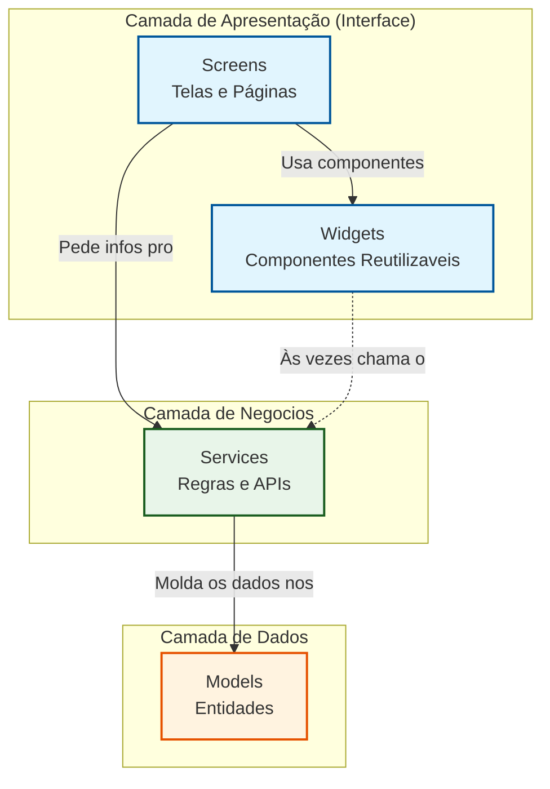

# Arquitetura de camadas do App Flutter JardimJá

Este documento apresenta a organização do código do aplicativo JardimJá e a estrutura adotada para o desenvolvimento do projeto.

A ideia principal é manter cada parte do sistema responsável por uma função específica, evitando que regras de negócio, interface e manipulação de dados fiquem misturadas.

## Organização das pastas em lib/:

models/ — Camada de Dados

Nessa pasta ficam as classes que representam as entidades do sistema, como Usuário, Serviço e Solicitação. Essas classes definem apenas a estrutura dos dados e não contêm lógica de interface ou regras de negócio.

services/ — Camada de Negócios

A pasta services concentra as regras de negócio da aplicação. É nela que ficam as operações relacionadas à comunicação com a API, validações, processamento de dados e demais funcionalidades do sistema.

screens/ — Camada de Apresentação

As screens representam as telas principais do aplicativo, como login, cadastro e listagem de serviços. O foco dessa camada é construir a interface e capturar as ações do usuário, sem implementar diretamente regras de negócio ou acesso a dados.

widgets/ — Componentes Reutilizáveis

Nessa pasta ficam os componentes reutilizáveis da interface, como botões, campos de texto e cards. O objetivo é evitar repetição de código e manter a padronização visual do aplicativo.

## Fluxo entre as camadas

O fluxo que a gente pensou foi esse:
O usuário clica em algo na tela (`screens` ou `widgets`). A tela não resolve o problema, ela pede pra um serviço (`services`) se virar. O serviço vai lá, processa o que precisa, transforma os dados num modelo nosso (`models`) e devolve pra tela só exibir. 

Sempre de fora pra dentro: a Tela conhece o Serviço, mas o Serviço não tem nem ideia de qual tela chamou ele.

---

## Diagrama da Arquitetura

Instale a extensão \`Markdown Preview Mermaid Support\` para visualizar.

