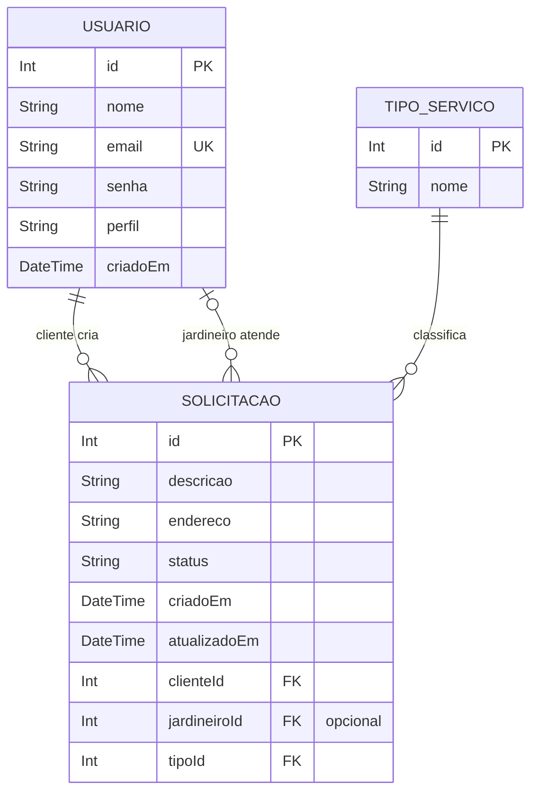

# Schema visual do banco de dados

Diagrama do banco definido em `jardimja-backend/prisma/schema.prisma`.

## Relacionamentos

- Um `Usuario` cliente pode criar varias `Solicitacao`.
- Um `Usuario` jardineiro pode atender varias `Solicitacao`, mas a solicitacao pode ficar sem jardineiro enquanto estiver pendente.
- Um `TipoServico` pode aparecer em varias `Solicitacao`.